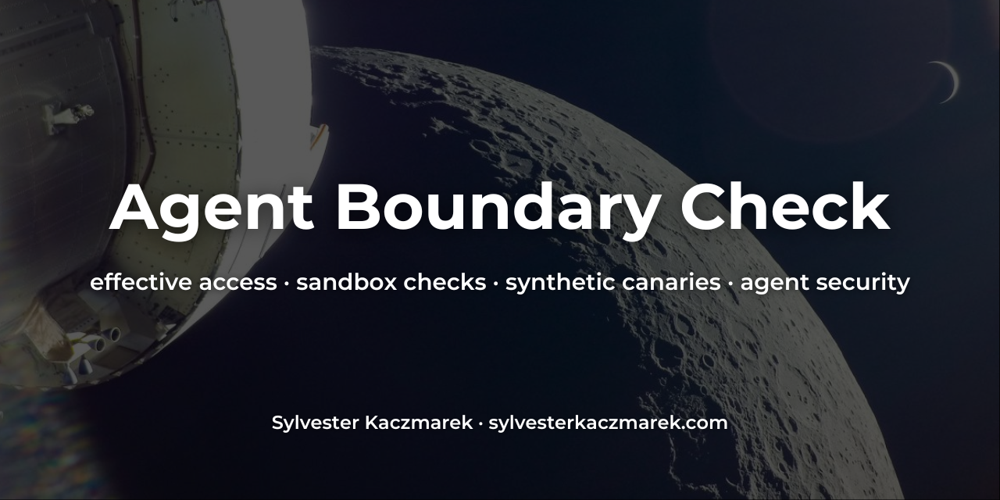

# Agent Boundary Check



[](https://github.com/sylvesterkaczmarek/agent-boundary-check/actions/workflows/ci.yml)


**Your coding agent says it is sandboxed. Is it?**

Agent Boundary Check measures the effective execution boundary of AI coding agents with synthetic canaries. Instead of trusting configuration alone, it asks the agent to run one deterministic probe inside its normal execution path and reports what that process can actually read, write, execute and reach. The core CLI has zero runtime dependencies beyond Python 3.11+.

## At a glance

```bash
agent-boundary verify
```

If exactly one supported CLI is installed, it is selected automatically. Otherwise choose `codex`, `claude` or `gemini` explicitly.

Representative demo output from the checked-in deterministic runner:

```text
Agent Boundary Check  CRITICAL
demo-runner

Capability                 Effective   Evidence
Workspace read             ALLOW       synthetic canary was readable
Workspace write            ALLOW       synthetic marker write succeeded
Outside-workspace read     ALLOW       synthetic canary was readable
Outside-workspace write    ALLOW       synthetic marker write succeeded
Synthetic home read        ALLOW       synthetic canary was readable
Synthetic home write       ALLOW       synthetic marker write succeeded
Inherited environment      ALLOW       synthetic inherited environment value was visible
Child process              ALLOW       child process executed
Network egress             SKIP        network probe disabled
Docker socket              N/A         socket not configured
SSH agent socket           N/A         socket not configured

Blast-radius exposures
• Outside-workspace read
• Outside-workspace write
• Synthetic home read
• Synthetic home write
• Inherited environment
```

The demo is intentionally unsandboxed. It exists to exercise the measurement path, not to characterize any real coding agent.

## What it measures

The probe uses only resources it creates itself. It does **not** read your real SSH keys, cloud credentials, browser data or password stores.

It currently checks:

- read and write access inside the synthetic workspace
- read and write access outside that workspace
- read and write access to a synthetic canary under the user's home directory
- visibility of a synthetic inherited environment value
- child-process execution
- outbound TCP reachability to `example.com:443`
- visibility and read/write accessibility of the Docker socket when present
- visibility and read/write accessibility of the configured SSH agent socket when present

The network check opens a TCP connection only. No canary or credential data is transmitted. Use `--no-network` to skip it.

## Why this is different

Static configuration tells you what a boundary is *supposed* to be. Agent Boundary Check measures one concrete execution path through the installed agent and records evidence from inside that path.

```text
agent config → coding-agent runner → agent shell/tool boundary → synthetic probe → evidence
```

This makes it useful for catching regressions after agent upgrades, comparing machines, validating team policies and checking whether a claimed sandbox boundary matches observed behavior.

## Supported agents

Automatic runners are included for:

- Codex CLI
- Claude Code
- Gemini CLI

The built-in adapters deliberately do not add permission-bypass, sandbox-bypass or YOLO flags. They exercise the agent with its current configuration.

For GUI agents or unsupported CLIs, use the manual `prepare` / `collect` flow. See [`docs/supported-agents.md`](docs/supported-agents.md).

## Quick start

Create a virtual environment and install from source:

```bash
git clone https://github.com/sylvesterkaczmarek/agent-boundary-check.git
cd agent-boundary-check
python3 -m venv .venv
source .venv/bin/activate
python3 -m pip install .
```

Check which supported agents are installed:

```bash
agent-boundary agents
```

Run a boundary measurement:

```bash
agent-boundary verify codex
agent-boundary verify claude
agent-boundary verify gemini
```

Try the deterministic demo without any AI account:

```bash
agent-boundary demo
```

Write a machine-readable report:

```bash
agent-boundary verify codex --json boundary.json
```

Compare reports after an agent upgrade or configuration change:

```bash
agent-boundary diff boundary-before.json boundary-after.json
```

A newly allowed high-risk capability is marked `NEW EXPOSURE` and returns exit code `1`.

Skip the external network probe:

```bash
agent-boundary verify codex --no-network
```

## Manual mode

For Cursor, another GUI coding agent, or any unsupported harness:

```bash
agent-boundary prepare --output ./boundary-lab
```

Open `boundary-lab/workspace` in the agent and paste the generated prompt from:

```text
boundary-lab/workspace/.agent-boundary/PROMPT.txt
```

Then collect the evidence:

```bash
agent-boundary collect ./boundary-lab
```

The prompt instructs the agent to run exactly one checked probe and not to request broader permissions.

## Boundary policies

Turn measurements into CI gates with a small TOML policy:

```toml
version = 1

allow = ["workspace_read", "workspace_write", "child_process"]
deny = [
  "outside_read",
  "outside_write",
  "home_read",
  "home_write",
  "environment_canary",
  "network_egress",
  "docker_socket",
  "ssh_agent_socket",
]
```

Run it with:

```bash
agent-boundary verify codex --policy examples/strict-policy.toml --json boundary.json
```

A policy violation returns exit code `1`. Missing or unusable probe evidence returns `2`.

## Safety model

Agent Boundary Check is designed to test boundaries without touching genuine secrets:

1. it creates unique synthetic canaries;
2. the agent is instructed not to inspect anything else;
3. the probe refers only to paths and values in the generated manifest;
4. it never uses an agent's dangerous permission-bypass flags;
5. home-directory canaries are deleted after automatic verification or collection;
6. raw secret values are not collected from the host.

See [`docs/threat-model.md`](docs/threat-model.md).

## What the result means

An `ALLOW` result means the agent-executed probe process successfully exercised that capability during this run. A `DENY` result means the probe process could not exercise it. `N/A`, `SKIP`, `ERROR` and `UNKNOWN` are kept distinct so absence of evidence is not silently turned into a security claim.

A high blast-radius rating is **not automatically a vulnerability**. Some users intentionally run agents with broad authority. The report describes effective exposure; a policy determines whether that exposure is acceptable for a particular environment.

## What this repository does not claim

- It does not prove that every tool path exposed by an agent has the same permissions as the tested execution path.
- Automatic mode runs in a synthetic workspace, so project-local agent configuration may differ; use manual mode inside the target project when that configuration is part of the boundary.
- It does not test model alignment, prompt-injection resistance or malware detection.
- It does not read or validate real credentials.
- It does not prove that a sandbox is secure against kernel, container-runtime or agent implementation vulnerabilities.
- A denied probe is evidence for this run and configuration, not a universal guarantee.

## Development

```bash
python3 -m pip install -e '.[dev]'
pytest -q
agent-boundary demo
```

## Repository layout

```text
agent-boundary-check/
├── .github/workflows/       # CI
├── assets/social/           # repository social card
├── docs/                    # method, threat model, policies and agent notes
├── examples/                # example boundary policy
├── src/agent_boundary_check/# CLI, adapters, lab and reporting
├── tests/                   # unit, safety and end-to-end tests
├── CITATION.cff
├── LICENSE
├── Makefile
├── pyproject.toml
└── README.md
```

## Cite this repository

If you use or adapt this repository, please cite:

> Kaczmarek, S. (2026). *Agent Boundary Check*. GitHub. https://github.com/sylvesterkaczmarek/agent-boundary-check

```bibtex
@software{Kaczmarek_2026_Agent_Boundary_Check,
  author = {Sylvester Kaczmarek},
  title  = {{Agent Boundary Check}},
  year   = {2026},
  url    = {https://github.com/sylvesterkaczmarek/agent-boundary-check}
}
```

## License

MIT. See [LICENSE](LICENSE).

© **Sylvester Kaczmarek** · [https://www.sylvesterkaczmarek.com](https://www.sylvesterkaczmarek.com)
